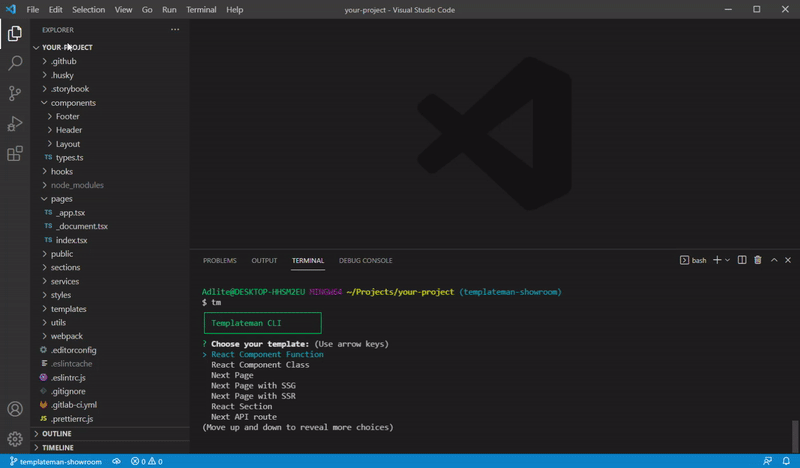

# Templateman

Simple and flexible code generating CLI tool for frequently used components.



## Concepts
Templateman is designed to facilitate creation a large number of repeating components
and make you free from this drudgery.

It provides the ability to generate new files, directories
and file structures based on code templates, regardless of the file type, framework or programming language.

Think of Templateman as VS Code snippets or WebStorm Live Templates, but which generates the file structure of each snippet and is independent of the IDE.

Templateman includes 2 main units:
- **Code templates:** files which are used as templates
  and can contain special Templateman variables in the form of `${TM:VARIABLE_NAME}`.
- **Templateman config:** describes and combines all your code templates, which you will use, including their names, location and output path.
  Templateman finds and loads a configuration object from:
  - a `templateman.config.js` CommonJS module
  - a JSON or YAML `.templatemanrc` file
  - a `templateman` property in `package.json`

## Install
```shell
npm install templateman -g
```
or if you use Yarn
```shell
yarn global add templateman
```

## Usage

### Basic example

Let's imagine that you use React, CSS Modules and snapshot tests in your project.

Creating a huge number of such components can tire you very quickly. 
You can automate this process with Templateman so that you don't have to do repetitive work over and over again.

Firstly, create a component template file in your project.

*./templates/react-func.template:*
```
import React from 'react';
import PropTypes from 'prop-types';
import style from './style.module.css';

function ${TM:COMPONENT_NAME}({children}) {
  return <div className={style.${TM:COMPONENT_NAME}}>{children}</div>;
}

${TM:COMPONENT_NAME}.defaultProps = {
  children: '',
};

${TM:COMPONENT_NAME}.propTypes = {
  children: PropTypes.node,
};

export default ${TM:COMPONENT_NAME};

```
Here `${TM:COMPONENT_NAME}` is a special syntax for Templateman variables.
Variable name may contain only latin characters in uppercase, digits and underscore symbol.

Then create templateman config file.

*./templatemanrc.json:*
```json
{
  "templates": [
    {
      "name": "React Functional Component",
      "files": [
        {
          "from": "./templates/react-func.template",
          "to": "./src/components/${TM:COMPONENT_NAME}/${TM:COMPONENT_NAME}.js"
        }
      ]
    }
  ]
}
```
As you can see `${TM:VARIABLE_NAME}` syntax is allowed also in `to` field in templateman config.

Now just type `tm` in your console:

```shell
$ tm
```

As you can see `React Functional Component` appeared in the list.
After selecting it option Templateman will walk through all the template files in selected template and look for variables there.

In the example above template files have only one `${TM:COMPONENT_NAME}` variable. But it's possible to include variables with different names. 

Then when you set variable values they will be replaced and new template contents will be emitted into output file
specified in `to` field.

### Complex React-component

Now let's complicate the task and add CSS module, re-export file and snapshot test file into component template.

First add required template files.

*./templates/css-module.template:*
```
.${TM:COMPONENT_NAME} {}
```

*./templates/export-module.template:*
```
export {default} from './${TM:COMPONENT_NAME}';
```

*./templates/react-test-spec.template:*
```
import React from 'react';
import renderer from 'react-test-renderer';
import ${TM:COMPONENT_NAME} from './${TM:COMPONENT_NAME}';

it('Renders ${TM:COMPONENT_NAME} correctly', () => {
  const tree = renderer.create(<${TM:COMPONENT_NAME} />).toJSON();
  expect(tree).toMatchSnapshot();
});
```

And extend templateman config file.

*./templatemanrc.json:*
```json
{
  "templates": [
    {
      "name": "React Functional Component",
      "files": [
        {
          "from": "./templates/react-func.template",
          "to": "./src/components/${TM:COMPONENT_NAME}/${TM:COMPONENT_NAME}.js"
        },
        {
          "from": "./templates/export-module.template",
          "to": "./src/components/${TM:COMPONENT_NAME}/index.js"
        },
        {
          "from": "./templates/css-module.template",
          "to": "./src/components/${TM:COMPONENT_NAME}/style.module.css"
        },
        {
          "from": "./templates/react-test-spec.template",
          "to": "./src/components/${TM:COMPONENT_NAME}.test.js"
        }
      ]
    }
  ]
}
```

Then run `tm` command in your terminal and see how Templateman magic works.

### Case transformers
*Requires 0.1.0 version or higher.*

Sometimes you need to change case in Templateman variables. 
For example, if your team use `kebab-case` in project file names, but framework requires to name its components in `PascalCase`.

You can add `:CASE_RULE` postfix into `${TM:VARIABLE_NAME}` to postprocess values of Templateman variables.

If you take the example above you can change config like this:
```json
{
  "templates": [
    {
      "name": "React Functional Component",
      "files": [
        {
          "from": "./templates/react-func.template",
          "to": "./src/components/${TM:COMPONENT_NAME:KEBAB_CASE}/${TM:COMPONENT_NAME:KEBAB_CASE}.js"
        },
        {
          "from": "./templates/export-module.template",
          "to": "./src/components/${TM:COMPONENT_NAME:KEBAB_CASE}/index.js"
        },
        {
          "from": "./templates/css-module.template",
          "to": "./src/components/${TM:COMPONENT_NAME:KEBAB_CASE}/style.module.css"
        },
        {
          "from": "./templates/react-test-spec.template",
          "to": "./src/components/${TM:COMPONENT_NAME:KEBAB_CASE}.test.js"
        }
      ]
    }
  ]
}
```

And don't forget to change imports in your template files.

*./templates/export-module.template:*
```
export {default} from './${TM:COMPONENT_NAME:KEBAB_CASE}';
```

*./templates/react-test-spec.template:*
```
import React from 'react';
import renderer from 'react-test-renderer';
import ${TM:COMPONENT_NAME} from './${TM:COMPONENT_NAME:KEBAB_CASE}';

it('Renders ${TM:COMPONENT_NAME} correctly', () => {
  const tree = renderer.create(<${TM:COMPONENT_NAME} />).toJSON();
  expect(tree).toMatchSnapshot();
});
```

### List of available case transformers

| Postfix                | Transforms variable to   |
|------------------------|--------------------------|
| `:CAMEL_CASE`          | `fooBarBaz`              |
| `:PASCAL_CASE`         | `FooBarBaz`              |
| `:KEBAB_CASE`          | `foo-bar-baz`            |
| `:TRAIN_CASE`          | `FOO-BAR-BAZ`            |
| `:SNAKE_CASE`          | `foo_bar_baz`            |
| `:CONSTANT_CASE`       | `FOO_BAR_BAZ`            |
| `:DOT_CASE`            | `foo.bar.baz`            |
| `:UPPER_DOT_CASE`      | `FOO.BAR.BAZ`            |
| `:SENTENCE_CASE`       | `Foo bar baz`            |
| `:CAP_SENTENCE_CASE`   | `Foo Bar Baz`            |
| `:UPPER_SENTENCE_CASE` | `FOO BAR BAZ`            |
| `:LOWER_SENTENCE_CASE` | `foo bar baz`            |

### More examples
Templateman is not limited to just one framework or programming language. 
You can use it to create any boilerplate code in your project such as components, styles, state managers, API routes, controllers, models, views, mocks and so on. 
You can use it at front-end, back-end, mobile development, desktop development and basically everywhere if you have Node.js installed on your computer.

See more template examples [here](https://github.com/adlite/templateman/tree/master/examples).

## Maintainers
- [Igor Sebelev](https://github.com/adlite)

## License
Apache 2.0
